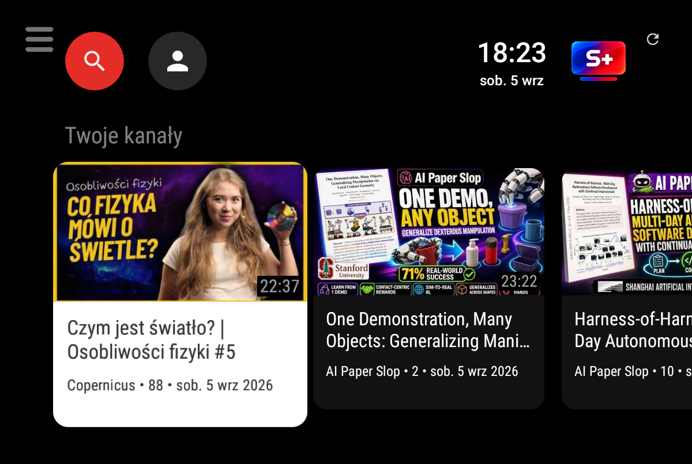

# SmartTube+

Fork [SmartTube](https://github.com/yuliskov/SmartTube) (baza v32.40) z trzema
zmianami, których brakowało na tablecie — i które działają **bez logowania
do konta YouTube**.

## Czym się różni od SmartTube'a

### 1. Wiersz „Twoje kanały” na górze strony głównej

Pierwszy wiersz Home to najnowsze filmy **z Twojej lokalnej listy kanałów** —
tej, którą SmartTube trzyma w menu „Subskrypcje” (import z NewPipe / PocketTube /
GrayJay albo dodane ręcznie).

- **Bez logowania do YouTube** — zamiast API subskrypcji (wymaga konta) używamy
  publicznych feedów RSS kanałów.
- **Cache-first** — wiersz jest na ekranie od razu po starcie, jeszcze zanim
  doładują się domyślne wiersze YouTube'a.
- **Doładowywanie** — na start 40 pozycji, po dojechaniu do końca dosypuje
  kolejne 20 (natychmiast, z już pobranego zapasu do 200).

### 2. Dwa przyciski dotykowe na górnej belce

SmartTube jest robiony pod pilota. Na tablecie palcem nie dało się schować
lewego menu — teraz można:

| przycisk | gdzie | działanie |
|----------|-------|-----------|
| ☰ hamburger | lewy górny róg | zwija / rozwija boczne menu |
| ⟳ odświeżanie | prawy górny róg | kręci się, gdy feed się odświeża; kliknięcie = ręczne odświeżenie |

Przyciski nie biorą udziału w nawigacji pilotem — d-pad działa dokładnie jak
w oryginale.

### 3. Osobna aplikacja

Własna nazwa i ikona, osobny pakiet (`org.smarttube.plus.stable`) — instaluje
się **obok** oryginalnego SmartTube'a, nie nadpisuje go.

## Instalacja

Wymagane: lokalna lista kanałów (menu **Subskrypcje → import** albo dodanie
ręcznie) — bez niej wiersza po prostu nie ma (celowo).

## Pobierz APK

- **GitHub Releases** (najnowsza wersja):
  [SmartTube+ v32.40 — armeabi-v7a](https://github.com/pijusdev/SmartTubePlus/releases/download/v32.40-stplus/SmartTubePlus-v32.40-armeabi-v7a.apk)
  (32-bit: tablety, Android TV boxy) ·
  [universal](https://github.com/pijusdev/SmartTubePlus/releases/download/v32.40-stplus/SmartTubePlus-v32.40-universal.apk)
  (wszystkie architektury)
- **Stały link** (zawsze najnowsza):
  <https://meble-comfort.pl/up/uploads/SmartTubePlus.apk>

Instalacja jak zwykle: „instalowanie z nieznanych źródeł”.

## Dla deweloperów

Cały kod funkcji to jeden plik
(`common/src/main/java/com/liskovsoft/smartyoutubetv2/common/stplus/StPlus.java`)
plus siedem krótkich haków w kodzie oryginału. Pełna mapa zmian, pułapki i
procedura reaplikacji po aktualizacji upstreama:
[STPLUS/MODYFIKACJE.md](STPLUS/MODYFIKACJE.md)
(latka: [STPLUS/patches](STPLUS/patches)).

Celem forka jest to, żeby te funkcje weszły do SmartTube'a na stałe.

## Licencja

MIT — jak oryginalny SmartTube. Autor oryginału:
[yuliskov](https://github.com/yuliskov/SmartTube).
