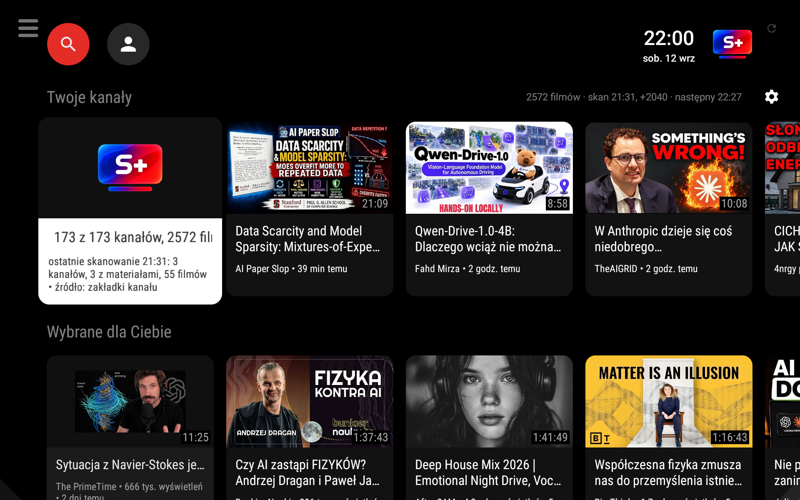
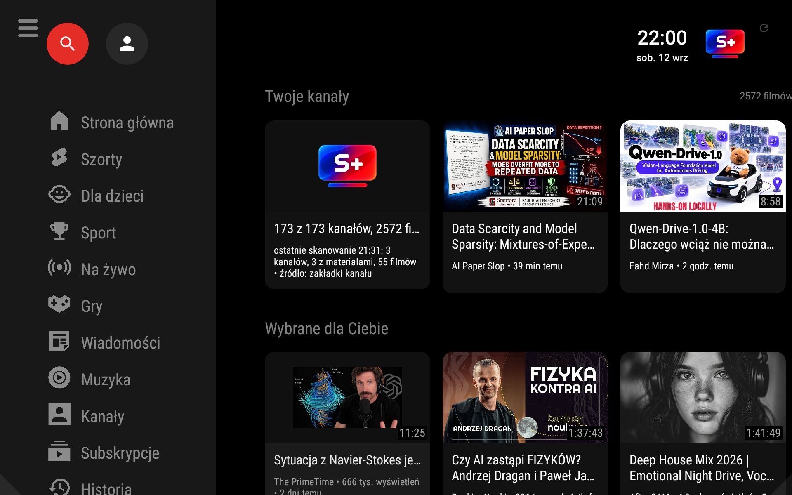
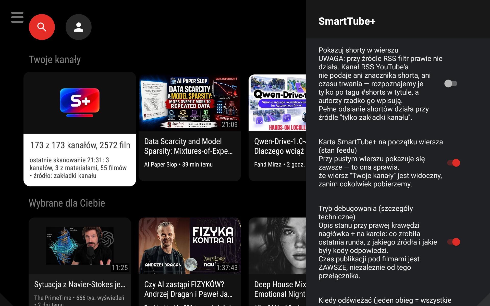

# SmartTube+

A small fork of [SmartTube](https://github.com/yuliskov/SmartTube) (base v32.40) that adds a **"Your channels" row** on the home screen — a private subscription feed that works **without signing in to YouTube**.

## Screenshots

---

## ⚠️ Note on the previous release (v32.40-stplus, Sep 5)

**We apologize.** The first public build had serious performance and stability problems:

- **CPU usage at ~140%** — the app was flooding YouTube with 50 simultaneous requests plus 50 extra heavy API calls per channel, saturating the processor on low-end devices.
- **HTTP 404 on nearly all channels** — the request burst triggered YouTube's throttling, so most channels returned errors and the row was mostly empty.
- **Cache destruction** — overlapping refresh cycles were overwriting good data with partial results, losing the entire feed.
- **Infinite scanning** — a logic error made the rotation never terminate after a manual refresh.
- **Crash on fast scrolling** — a `RecyclerView` state exception killed the app when swiping quickly.
- **Wrong sort order** — publication dates were being zeroed out, showing old videos at the top.
- **Debug build** — the shipped APK had HTTP body logging enabled, adding massive I/O overhead.

All of the above are fixed in this release. The new feed engine was rewritten from scratch based on measured data from real devices.

---

## What's new in this release (v32.40-stplus.2, Sep 12)

### Feed engine — rewritten

- **Rotation-based refresh** — each round takes a small batch of the least-recently-checked channels (configurable: gentle / normal / fast). The app never floods YouTube.
- **Per-channel store** — results are merged, never overwritten wholesale. A channel that fails to answer keeps the items it already had.
- **Two sources** — RSS (cheap, carries real timestamps) and the channel's video tab (heavier, works when RSS refuses). Automatic fallback or force either one in settings.
- **Cache-first** — the row is drawn from the local store instantly on start, before any network call.
- **Guaranteed cycle end** — the rotation always terminates. No more infinite scanning.

### Stability

- **Crash on fast scrolling fixed** — adapter mutations now posted to the main looper outside the scroll callback. Verified: 300 rapid swipes, zero crashes.
- **Date/sort order fixed** — publication dates are extracted correctly from both sources. Videos are sorted newest-first. Verified: 2560 items, 0 without a date.
- **No more cache destruction** — overlapping cycles are guarded; partial results never overwrite good data.

### Performance

- **CPU reduced** — removed per-channel `browse` API calls (−50 heavy requests per cycle), switched HTTP logging from BODY to BASIC, disabled the OkHttp profiler, and batched store writes (every 6 rounds instead of every round).
- **Paced requests** — 2 channels in parallel, 700 ms between requests, 6 s between rounds (normal profile). Configurable in settings.

### Settings menu (gear icon on the "Your channels" row)

- **Shorts filter** — toggle on/off. Uses 60-second duration threshold (works fully on the channel-tab source; RSS carries no duration data — this is a data limitation, noted in the UI).
- **Language** — system / Polish / English (for SmartTube+ texts only).
- **Refresh schedule** — manual only / on start + every 30 min / 1 h / 3 h / 6 h.
- **Speed profile** — gentle (~35 ch/min) / normal (~75) / fast (~150), with the basis stated ("with about 200 channels").
- **Source** — automatic / RSS only / channel tab only.
- **Debug mode** — technical details in the row header and status card.
- **Status card** — always visible, shows live progress ("scanning… 140 of 173 channels, +1 new") or the last cycle summary.

### UI

- **Gear icon** — a real, focusable `ImageView` on the right side of the row header. Works with both touch (tablet) and D-pad (remote).
- **"Your channels" row is always present** — from the first frame, even with an empty store (shows a status card).
- **Publication time** — always shown under each video (not gated behind debug mode).
- **Status description** — on the right side of the header, small and unobtrusive.

---

## How it works (for users)

1. **Import your channel list** — in SmartTube+ go to **Subscriptions → Import** (from NewPipe, PocketTube, or GrayJay export) or add channels manually. Without a local list, the row won't appear (by design).

2. **The row appears** at the top of the home screen, showing the newest videos from your channels, sorted by publication date.

3. **The feed refreshes automatically** in the background using rotation — a few channels per round, spread over time. You can also trigger a manual refresh from the settings menu.

4. **No YouTube account needed.** The app reads public RSS feeds and channel pages. Nothing is stored on Google's side. No tracking.

---

## Download

| Architecture | Link |
|---|---|
| **armeabi-v7a** (32-bit: tablets, Android TV boxes) | [SmartTubePlus-v32.40.2-armeabi-v7a.apk](https://github.com/pijusdev/SmartTubePlus/releases/download/v32.40-stplus.2/SmartTubePlus-v32.40.2-armeabi-v7a.apk) |
| **universal** (all architectures) | [SmartTubePlus-v32.40.2-universal.apk](https://github.com/pijusdev/SmartTubePlus/releases/download/v32.40-stplus.2/SmartTubePlus-v32.40.2-universal.apk) |

Install as usual: allow "install from unknown sources".

The app installs **alongside** the original SmartTube (separate package: `org.smarttube.plus.stable`).

---

## For developers

All SmartTube+ logic lives in dedicated files (plugin architecture — the upstream code contains only short, marked hooks `>>> STPLUS` / `<<< STPLUS`):

| File | Role |
|---|---|
| `common/.../stplus/StPlus.java` | Row logic, rotation, rendering |
| `common/.../stplus/StPlusStore.java` | Per-channel store, merge, pick |
| `common/.../stplus/StPlusSettings.java` | Settings dialog, speed profiles |
| `common/.../stplus/StPlusText.java` | PL/EN strings |
| `smarttubetv/.../StPlusRowPresenter.java` | Row header (status + gear) |
| `smarttubetv/.../StPlusStatusCard.java` | Status card appearance |
| `MediaServiceCore/.../StPlusFeedSource.kt` | Channel-tab feed source |

Full change map, pitfalls, and reapplication procedure: [STPLUS/MODYFIKACJE.md](STPLUS/MODYFIKACJE.md)

The goal of this fork is for these features to land upstream. If they do, the fork stops being necessary — which would be the best outcome.

---

## License

MIT — same as the original SmartTube. Original author: [yuliskov](https://github.com/yuliskov/SmartTube).
